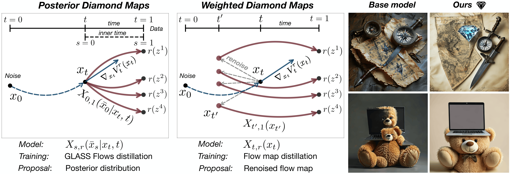

# Diamond Maps: Efficient Reward Alignment via Stochastic Flow Maps


[](https://arxiv.org/abs/2602.05993)

**Authors**: Peter Holderrieth\*, Douglas Chen\*, Luca Eyring\*, Ishin Shah, Giri Anantharaman, Yutong He, Zeynep Akata, Tommi Jaakkola, Nicholas Matthew Boffi, Max Simchowitz


## Abstract

Flow and diffusion models produce high-quality samples, but adapting them to user preferences or constraints post-training remains costly and brittle, a challenge commonly called reward alignment. We argue that efficient reward alignment should be a property of the generative model itself, not an afterthought, and redesign the model for adaptability. We propose "Diamond Maps", stochastic flow map models that enable efficient and accurate alignment to arbitrary rewards at inference time. Diamond Maps amortize many simulation steps into a single-step sampler, like flow maps, while preserving the stochasticity required for optimal reward alignment. This design makes search, sequential Monte Carlo, and guidance scalable by enabling efficient and consistent estimation of the value function. Our experiments show that Diamond Maps can be learned efficiently via distillation from GLASS Flows, achieve stronger reward alignment performance, and scale better than existing methods.



## Methods

We introduce two Diamond Map designs:

### [Posterior Diamond Maps](./posterior_diamond_maps) _(code coming soon)_
One-step posterior samplers distilled from GLASS Flows. These offer optimal accuracy and efficiency at inference time by distilling stochastic transitions into a single-step sampler.

### [Weighted Diamond Maps](./weighted_diamond_maps)
An algorithm to turn standard flow maps into consistent value function estimators. This is a simple, highly effective plug-in estimator for efficient alignment of distilled flow and diffusion models, requiring no additional distillation of GLASS Flows.

---

The choice between the two is determined by a trade-off between training compute and inference-time compute. The Posterior Diamond Map requires distillation of GLASS Flows, while the Weighted Diamond Map requires only a standard flow map but may need more compute at inference time.

## Citation

```bibtex
@article{holderrieth2026diamondmaps,
      title={Diamond Maps: Efficient Reward Alignment via Stochastic Flow Maps}, 
      author={Peter Holderrieth and Douglas Chen and Luca Eyring and Ishin Shah and Giri Anantharaman and Yutong He and Zeynep Akata and Tommi Jaakkola and Nicholas Matthew Boffi and Max Simchowitz},
      year={2026},
      eprint={2602.05993},
      archivePrefix={arXiv},
      primaryClass={cs.LG},
      url={https://arxiv.org/abs/2602.05993}, 
}
