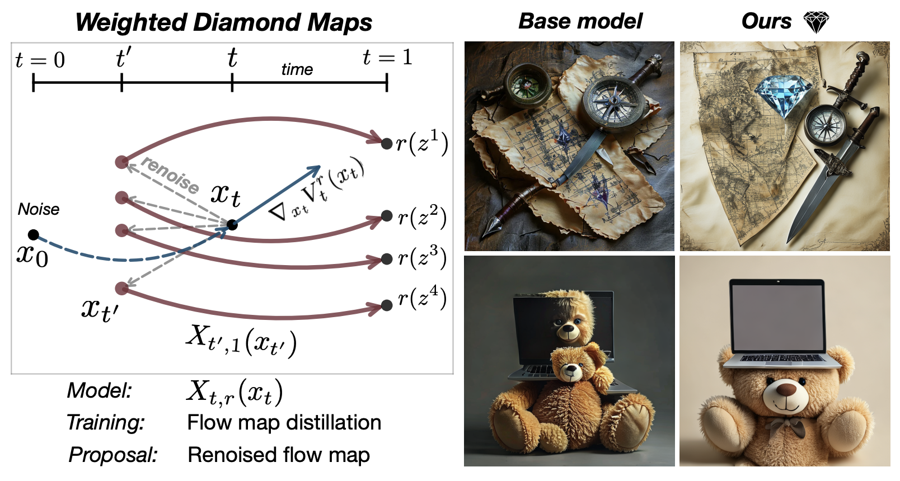
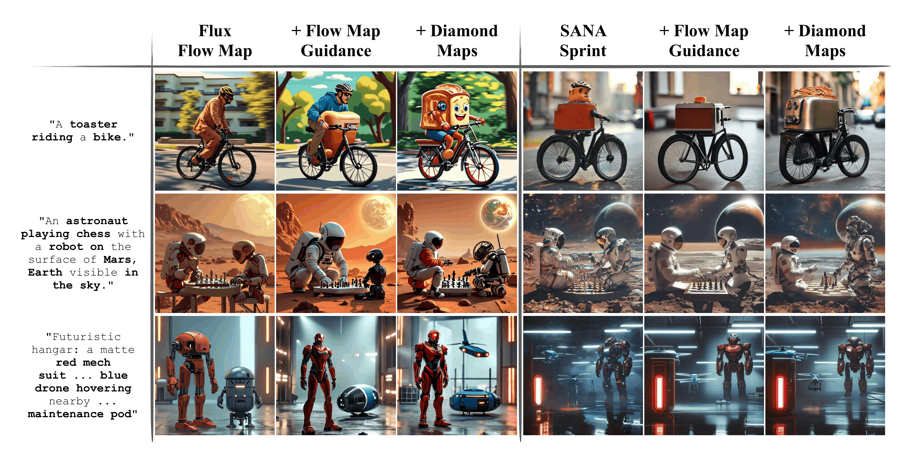

# Weighted Diamond Maps

Official implementation of the **Weighted Diamond Maps** experiments from
*Diamond Maps*. The code supports reward-guided text-to-image generation with
FLUX Flow Map and SANA-Sprint, and sample generation for GenEval and UniGenBench.

Weighted Diamond Maps draw lookahead particles from the current latent, score
their clean-image predictions, and aggregate particle information with
reward-dependent weights. Our setup uses reward-softmax particle weights
with reward, likelihood, and score-gradient terms.



## Installation

```bash
uv sync
```

FLUX.1-dev requires access through Hugging Face:

```bash
huggingface-cli login
```

Note that HPSv2 may not automatically download the OpenCLIP tokenizer. If that happens, download it manually as described [here](https://github.com/tgxs002/HPSv2/issues/30).

## Checkpoints

FLUX experiments use `black-forest-labs/FLUX.1-dev` with the Flow Map LoRA:

```text
gabeguofanclub/flux-1-dev-flowmap-lsd
```

The default LoRA weight is `01-12-26/runs/res_512_steps_50k_rank_64_lr_1e-4/checkpoint-43000/pytorch_lora_weights.safetensors`.

The SANA-Sprint experiments use `Efficient-Large-Model/Sana_Sprint_0.6B_1024px_diffusers`.

## Inference

Run Weighted Diamond Maps with FLUX:

```bash
uv run python infer.py \
  --model-family flux \
  --method weighted_diamond \
  --prompt "A toaster riding on a bike."
```

Run Weighted Diamond Maps with SANA:

```bash
uv run python infer.py \
  --model-family sana \
  --method weighted_diamond \
  --prompt "A toaster riding on a bike."
```

Run Flow Map Guidance:

```bash
uv run python infer.py \
  --model-family flux \
  --method flow_map_guidance \
  --prompt "A toaster riding on a bike."
```

Run multiple prompts from a file:

```bash
uv run python infer.py \
  --model-family flux \
  --method weighted_diamond \
  --prompt-file assets/example_prompts.txt
```

The default inference command uses FLUX defaults `n=25`, `g=24`,
and `snr=1.1`; SANA defaults `n=20`, `g=5`, and `snr=20`.

## Benchmark Generation

Generate FLUX Weighted Diamond Maps samples for GenEval:

```bash
uv run python benchmark_generate.py \
  --benchmark geneval \
  --model-family flux \
  --method weighted_diamond
```

Generate Flow Map Guidance samples:

```bash
uv run python benchmark_generate.py \
  --benchmark geneval \
  --model-family flux \
  --method flow_map_guidance
```

Generate Best-of-N samples:

```bash
uv run python benchmark_generate.py \
  --benchmark geneval \
  --model-family flux \
  --method best_of_n
```

Generate UniGenBench samples:

```bash
uv run python benchmark_generate.py \
  --benchmark unigenbench \
  --model-family flux \
  --method weighted_diamond
```

For FLUX Weighted Diamond Maps, the benchmark command expands to particle
counts `1,2,4,8,16,32` with `n=25`, `g=10`, and `snr=1.5`.




## Outputs

`infer.py` saves images under prompt and seed folders in `outputs_infer/` by default.
Each seed folder contains one run folder for same-seed base inference and, when
the selected method is not `base`, one run folder for the selected setting:

```text
outputs_infer/<prompt_slug>/seed_0/flux_base_n25_cfg1/final.png
outputs_infer/<prompt_slug>/seed_0/flux_weighted_diamond_composite_reward250_norm20_n25_cfg1_g24_start1_p4_snr1p1_fresh_rewardsoftmax/final.png
```

Each run folder contains `metadata.jsonl`, `final.png`, and, when enabled,
decoded trajectory images for `x_t` and clean predictions.

`benchmark_generate.py` writes evaluator-compatible sample folders:

```text
geneval/<run_name>/<prompt_id>/samples/<seed>.png
UniGenBench/eval_data/en/<run_name>/<prompt_id>_<image_id>.png
```

### CFG

`--cfg-guidance-scale` controls the pipeline guidance value and defaults to
`1.0`. We use `--cfg-guidance-scale=1.0` in all our experiments and `--gradient-norm-scale 20.0` is intended for that setting.
If you raise FLUX guidance to values like `3.5`, increase the gradient norm
scale too; `40.0` is a useful starting point for these higher-CFG runs:

```bash
uv run python infer.py \
  --model-family flux \
  --method weighted_diamond \
  --prompt "A toaster riding on a bike." \
  --cfg-guidance-scale 3.5 \
  --gradient-norm-scale 40.0
```

## Repository Structure

```text
assets/                 prompt metadata and example prompts
pipelines/              FLUX and SANA sampling pipelines
rewards/                reward models used for guidance
utils/                  shared loading and benchmark utilities
infer.py                prompt-level inference
benchmark_generate.py   benchmark sample generation
```
